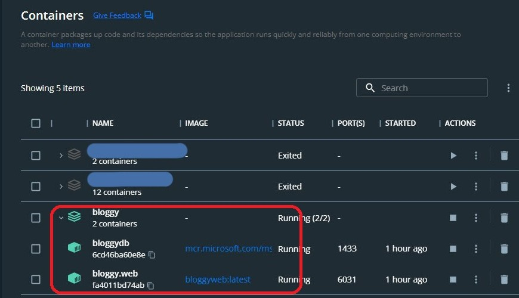

# Bloggy CMS - Blog engine for ASP.NET Core 7

Bloggy CMS is an open-source .NET Core written in ASP.NET. it is simple, easy to use, multi layer, light-weight blog engine and can be used to quickly and easily set up and fully functional personal or group blog.

## Demo
**Live demo**: https://bloggy-cms.ir/ 
**Admin panel demo**: https://bloggy-cms.ir/Account/Login/ 
Username: admin 
Password: admin

## Features
- Easy to use, develop and publish
- Pure bootstrap template
- Sweetalert for showing beautiful alert
- Support different databases - SQL Server, SQLite
- SEO Friendly
- Drag and drop image for upload
- Mulitple theme support
- Support multi language in admin panel
- Cross-platform: run it on Windows, Linux, or Mac
- SiteMap generator

## Techniques
- Written with the latest version of ASP.NET Core (Version 7)
- Entity Framework Core (EF Core)
- Auto register services
- Auto register map resources
- Dependency Injection using [Autofac (Ioc Container)](https://github.com/autofac/Autofac)
- Map resources using [AutoMapper](https://github.com/AutoMapper/AutoMapper)
- Follows best practices for web applications
- HTML editor using [CKEditor 4](https://github.com/ckeditor/ckeditor4)
- Generic repository

## Login

Default username and password declared in `appsettings` and you can change it  
When you open `example.com/Account/Login/` , if there is no user in the database, user will be created

## Screenshot

 

## Docker

 

### Todo
- [x] Docker
- [ ] Another template
- [ ] Slider module
- [ ] Unit test
- [ ] API
- [ ] Post comment module

## Credits
Default website template by :  https://github.com/themefisher/logbook  
SVG icons by : https://fonts.google.com/icons  
Admin template : https://getbootstrap.com/

## Support us
If this repository helped you, please support us by giving it a star, thanks 🙏

## License
All files in this repository is licensed under a MIT License.